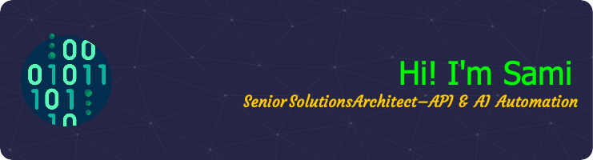

## 🚀 Technology Enthusiast | Solutions Architect | Automation Expert

💡 Passionate about API transformation, AI-driven automation, and cloud solutions. I specialize in designing scalable architectures, building intelligent automation systems, and driving digital transformation initiatives.

### 🤝 Connect with me:

 
- 💬 If you have any question/feedback, please do not hesitate to reach out to me!

## 📌 Recent Work:

Led an API transformation to enhance partner and customer integrations
Built an AI-powered self-healing system to reduce incident mitigation time
Developed automation services to enhance security and operational efficiency

## 🌱 I'm currently learning

- 📱 LLMs

## 💼 Technical Skills

### Languages

### Technologies and Tools

## 📈 GitHub Stats 

